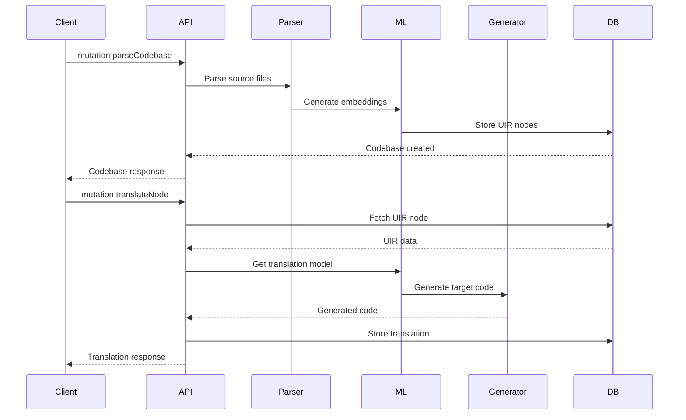
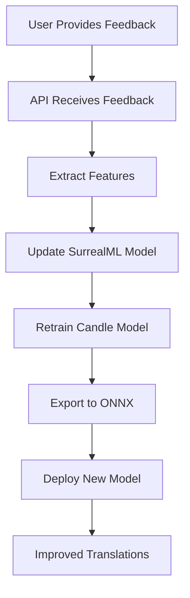
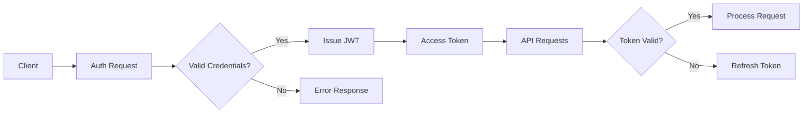

# Coalesce API Design

## Overview

Coalesce exposes a GraphQL API over WebSocket for real-time updates and efficient data fetching.

## GraphQL Schema

```graphql
# Core Types

type Project {
  id: ID!
  name: String!
  description: String
  codebases: [Codebase!]!
  created: DateTime!
  updated: DateTime!
}

type Codebase {
  id: ID!
  project: Project!
  language: Language!
  version: String!
  modules: [Module!]!
  stats: CodebaseStats!
}

type Module {
  id: ID!
  path: String!
  name: String!
  uirRoot: UIRNode!
  dependencies: [Module!]!
}

type UIRNode {
  id: ID!
  type: NodeType!
  name: String
  children: [UIRNode!]!
  metadata: Metadata!
  embeddings: [Float!]!
}

type Translation {
  id: ID!
  source: UIRNode!
  targetLanguage: Language!
  generatedCode: String!
  confidence: Float!
  status: TranslationStatus!
  feedback: [Feedback!]!
}

# Enums

enum Language {
  JAVASCRIPT
  TYPESCRIPT
  PYTHON
  RUST
  GO
  JAVA
  CSHARP
  COBOL
  FORTRAN
  # ... more languages
}

enum NodeType {
  FUNCTION
  CLASS
  INTERFACE
  VARIABLE
  CONSTANT
  CONTROL_FLOW
  EXPRESSION
}

enum TranslationStatus {
  PENDING
  PROCESSING
  COMPLETED
  FAILED
  REVIEWED
}

# Queries

type Query {
  # Project queries
  project(id: ID!): Project
  projects(filter: ProjectFilter): [Project!]!
  
  # Translation queries
  translation(id: ID!): Translation
  translations(sourceId: ID!, targetLanguage: Language!): [Translation!]!
  
  # Analysis queries
  analyzeCode(code: String!, language: Language!): UIRNode!
  suggestTranslations(nodeId: ID!): [TranslationSuggestion!]!
}

# Mutations

type Mutation {
  # Project management
  createProject(input: CreateProjectInput!): Project!
  updateProject(id: ID!, input: UpdateProjectInput!): Project!
  deleteProject(id: ID!): Boolean!
  
  # Code operations
  parseCodebase(projectId: ID!, input: ParseCodebaseInput!): Codebase!
  translateNode(nodeId: ID!, targetLanguage: Language!): Translation!
  
  # Feedback loop
  provideFeedback(translationId: ID!, input: FeedbackInput!): Feedback!
  approveTranslation(translationId: ID!): Translation!
}

# Subscriptions

type Subscription {
  # Real-time updates
  translationProgress(id: ID!): TranslationProgress!
  projectUpdates(projectId: ID!): ProjectUpdate!
  learningProgress: LearningUpdate!
}
```

## API Flow Diagrams

### Translation Flow



### Learning Flow



## WebSocket Protocol

### Connection

```javascript
// Client connection example
const client = new CoalesceClient({
  url: 'wss://api.coalesce.dev',
  auth: { token: 'jwt-token' }
});

// Subscribe to real-time updates
const subscription = client.subscribe({
  query: `
    subscription TranslationUpdates($id: ID!) {
      translationProgress(id: $id) {
        status
        progress
        currentStep
        estimatedTime
      }
    }
  `,
  variables: { id: 'translation-123' }
});
```

### Message Format

```typescript
interface WSMessage {
  id: string;
  type: 'query' | 'mutation' | 'subscription';
  payload: {
    query: string;
    variables?: Record<string, any>;
    operationName?: string;
  };
}

interface WSResponse {
  id: string;
  type: 'data' | 'error' | 'complete';
  payload: {
    data?: any;
    errors?: GraphQLError[];
  };
}
```

## REST Endpoints

For compatibility and specific use cases:

```yaml
# File upload
POST /api/v1/upload
  Content-Type: multipart/form-data
  Body: source files

# Bulk export
GET /api/v1/export/{projectId}
  Accept: application/zip

# Health check
GET /api/v1/health
  Response: { status: "ok", version: "1.0.0" }
```

## Authentication



## Rate Limiting

| Tier | Requests/Min | Concurrent Translations | Storage |
|------|--------------|------------------------|---------|
| Free | 60 | 2 | 100MB |
| Pro | 600 | 10 | 10GB |
| Enterprise | Unlimited | Unlimited | Unlimited |

## Error Handling

```graphql
interface Error {
  message: String!
  code: ErrorCode!
  path: [String!]
  extensions: ErrorExtensions
}

enum ErrorCode {
  AUTHENTICATION_ERROR
  AUTHORIZATION_ERROR
  VALIDATION_ERROR
  PARSING_ERROR
  TRANSLATION_ERROR
  RATE_LIMIT_ERROR
  INTERNAL_ERROR
}

type ErrorExtensions {
  timestamp: DateTime!
  requestId: String!
  details: JSON
}
```

## SDK Examples

### JavaScript/TypeScript

```typescript
import { CoalesceClient } from '@coalesce/sdk';

const client = new CoalesceClient({
  apiKey: process.env.COALESCE_API_KEY
});

// Parse a codebase
const codebase = await client.parseCodebase({
  projectId: 'proj-123',
  files: ['src/**/*.js'],
  language: 'JAVASCRIPT'
});

// Translate a module
const translation = await client.translate({
  moduleId: codebase.modules[0].id,
  targetLanguage: 'PYTHON'
});

// Provide feedback
await client.feedback({
  translationId: translation.id,
  correctedCode: '# corrected Python code',
  notes: 'Fixed async/await pattern'
});
```

### CLI Usage

```bash
# Parse a project
coalesce parse ./my-project --language javascript

# Translate to Python
coalesce translate proj-123 --to python --output ./translated

# Interactive mode
coalesce interactive proj-123
```
