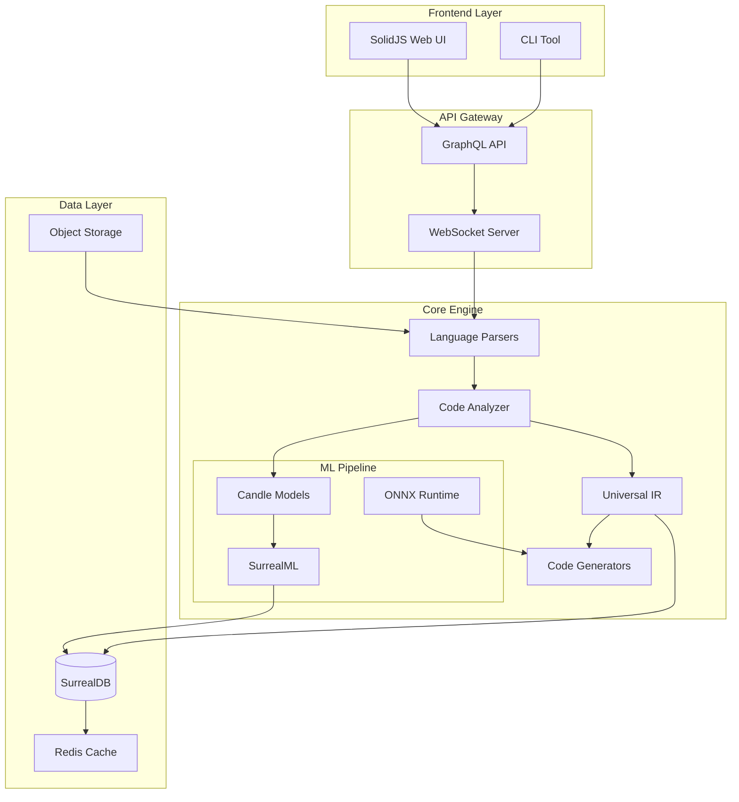
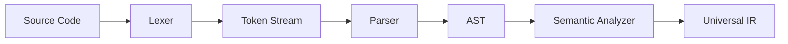
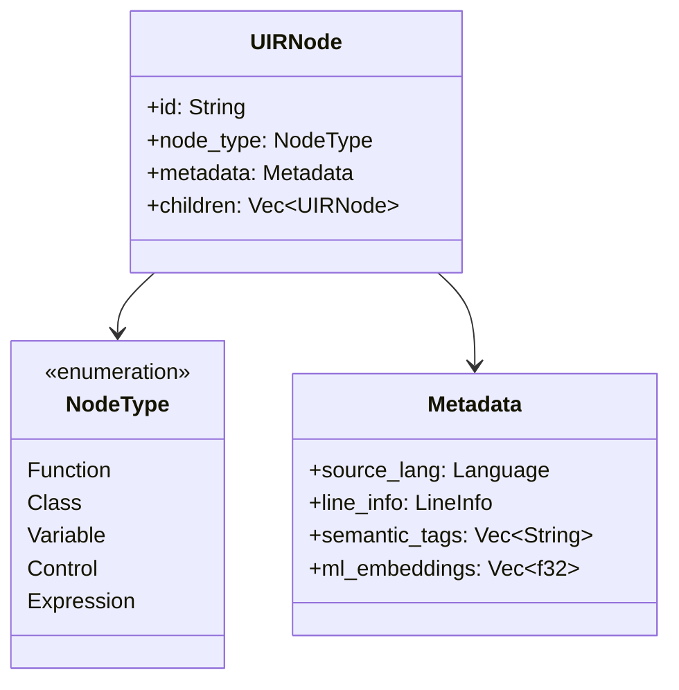
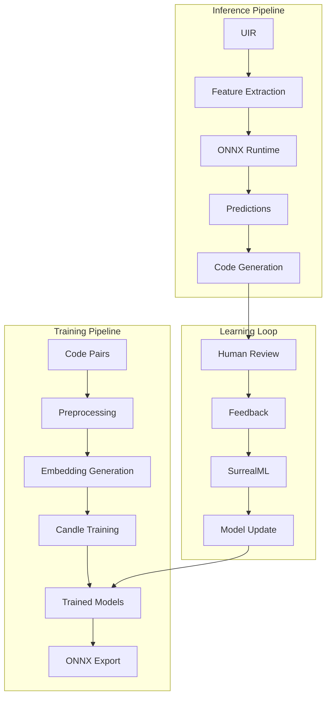
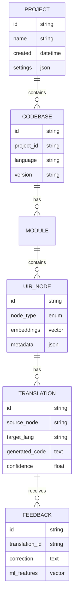
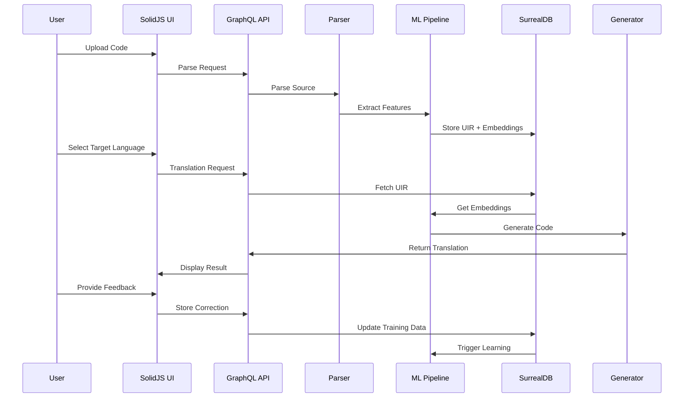
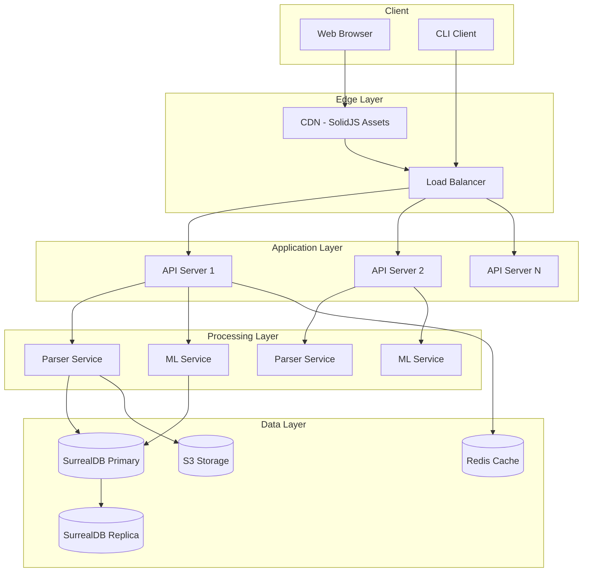

# Coalesce Architecture

## Overview

Coalesce is built as a modular, extensible system for universal code translation using a modern Rust-based stack with machine learning capabilities.

## Technology Stack

### Core Engine
- **Language**: Rust
- **ML Framework**: Candle (Rust-native deep learning)
- **Database**: SurrealDB with SurrealML
- **Inference**: Embedded ONNX Runtime
- **Frontend**: SolidJS
- **API**: GraphQL over WebSocket

### Architecture Diagram

## Component Details

### 1. Language Parsers (Rust)
Each language has a dedicated parser module that:
- Tokenizes source code
- Builds Abstract Syntax Trees (AST)
- Extracts semantic information
- Handles language-specific idioms

### 2. Universal Intermediate Representation (UIR)
The heart of Coalesce - a language-agnostic representation:

### 3. Machine Learning Pipeline

### 4. Data Model (SurrealDB)

## System Flow

## Deployment Architecture

## Security Architecture

- **Authentication**: JWT with refresh tokens
- **Authorization**: RBAC with SurrealDB's native permissions
- **Code Isolation**: Sandboxed parser execution
- **API Security**: Rate limiting, CORS, CSP headers
- **Data Encryption**: At-rest (SurrealDB) and in-transit (TLS)

## Performance Considerations

1. **Caching Strategy**
   - UIR nodes cached in Redis
   - ML inference results cached
   - Generated code cached with fingerprinting

2. **Parallel Processing**
   - Rust's async runtime for concurrent parsing
   - Batch processing for ML inference
   - Horizontal scaling for API servers

3. **Optimization**
   - ONNX Runtime for optimized inference
   - SurrealDB's graph queries for relationship traversal
   - Lazy loading of large codebases
