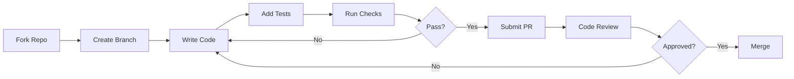
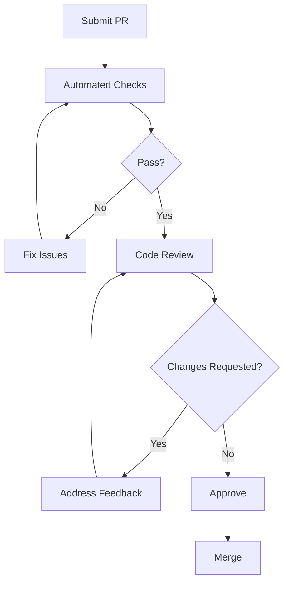

# Contributing to Coalesce

Thank you for your interest in contributing to Coalesce! This guide will help you get started with our Rust-based architecture.

## Development Setup

### Prerequisites

```bash
# Rust toolchain
curl --proto '=https' --tlsv1.2 -sSf https://sh.rustup.rs | sh
rustup default stable
rustup component add rustfmt clippy

# SurrealDB
curl -sSf https://install.surrealdb.com | sh

# Node.js (for SolidJS frontend)
curl -o- https://raw.githubusercontent.com/nvm-sh/nvm/v0.39.0/install.sh | bash
nvm install 20
nvm use 20

# ONNX Runtime
# macOS
brew install onnxruntime

# Linux
wget https://github.com/microsoft/onnxruntime/releases/download/v1.16.0/onnxruntime-linux-x64-1.16.0.tgz
tar -xvf onnxruntime-linux-x64-1.16.0.tgz
```

### Project Structure

```
coalesce/
├── crates/
│   ├── coalesce-core/       # Core types and traits
│   ├── coalesce-parser/     # Language parsers
│   ├── coalesce-ir/         # Universal IR
│   ├── coalesce-ml/         # Candle ML models
│   ├── coalesce-gen/        # Code generators
│   ├── coalesce-api/        # GraphQL API
│   └── coalesce-cli/        # CLI tool
├── frontend/
│   └── web/                 # SolidJS application
├── ml/
│   ├── models/              # Trained models
│   ├── training/            # Training scripts
│   └── onnx/               # ONNX exports
└── docs/                    # Documentation
```

## Development Workflow



### 1. Setup Development Environment

```bash
# Clone your fork
git clone https://github.com/YOUR_USERNAME/coalesce.git
cd coalesce

# Add upstream remote
git remote add upstream https://github.com/coalesce-dev/coalesce.git

# Install dependencies
cargo build --all
cd frontend/web && npm install
```

### 2. Start Development Services

```bash
# Terminal 1: Start SurrealDB
surreal start --log trace --user root --pass root memory

# Terminal 2: Start API server
cargo run --bin coalesce-api

# Terminal 3: Start frontend
cd frontend/web && npm run dev
```

## Adding a New Language Parser

### 1. Create Parser Module

```rust
// crates/coalesce-parser/src/languages/your_language.rs

use coalesce_core::{Language, ParseResult, Parser};
use coalesce_ir::UIRNode;

pub struct YourLanguageParser;

impl Parser for YourLanguageParser {
    fn language(&self) -> Language {
        Language::YourLanguage
    }

    fn parse(&self, source: &str) -> ParseResult<UIRNode> {
        // Implementation
    }
}
```

### 2. Add Tests

```rust
// crates/coalesce-parser/src/languages/your_language/tests.rs

#[cfg(test)]
mod tests {
    use super::*;

    #[test]
    fn test_parse_function() {
        let source = "function example() { return 42; }";
        let parser = YourLanguageParser;
        let result = parser.parse(source);
        assert!(result.is_ok());
    }
}
```

### 3. Register Parser

```rust
// crates/coalesce-parser/src/registry.rs

pub fn register_parsers() -> HashMap<Language, Box<dyn Parser>> {
    let mut parsers = HashMap::new();
    // ...existing parsers...
    parsers.insert(Language::YourLanguage, Box::new(YourLanguageParser));
    parsers
}
```

## Adding ML Models

### 1. Define Model Architecture

```rust
// crates/coalesce-ml/src/models/your_model.rs

use candle_core::{DType, Device, Tensor};
use candle_nn::{Module, VarBuilder};

pub struct YourModel {
    // Model layers
}

impl YourModel {
    pub fn new(vb: VarBuilder) -> Result<Self> {
        // Build model
    }
}

impl Module for YourModel {
    fn forward(&self, xs: &Tensor) -> Result<Tensor> {
        // Forward pass
    }
}
```

### 2. Training Pipeline

```python
# ml/training/train_your_model.py

import candle
import surrealml
from coalesce.training import TrainingPipeline

pipeline = TrainingPipeline(
    model_name="your_model",
    dataset_path="data/training_pairs.jsonl",
    output_path="ml/models/your_model.safetensors"
)

pipeline.train(
    epochs=100,
    batch_size=32,
    learning_rate=1e-4
)

# Export to ONNX
pipeline.export_onnx("ml/onnx/your_model.onnx")
```

## Testing Guidelines

### Unit Tests

```bash
# Run all tests
cargo test --all

# Run specific test
cargo test --package coalesce-parser test_parse_function

# Run with coverage
cargo tarpaulin --out Html
```

### Integration Tests

```rust
// tests/integration/translation_test.rs

#[tokio::test]
async fn test_full_translation() {
    let client = test_client().await;
    
    let source = include_str!("fixtures/example.js");
    let result = client
        .translate(source, Language::JavaScript, Language::Python)
        .await
        .unwrap();
        
    assert!(result.confidence > 0.9);
}
```

## Code Style

### Rust

```toml
# .rustfmt.toml
edition = "2021"
max_width = 100
use_field_init_shorthand = true
use_try_shorthand = true
```

```bash
# Format code
cargo fmt --all

# Lint
cargo clippy --all -- -D warnings
```

### TypeScript (Frontend)

```json
// frontend/web/.prettierrc
{
  "semi": true,
  "singleQuote": true,
  "tabWidth": 2,
  "trailingComma": "es5"
}
```

## Pull Request Process

### PR Template

```markdown
## Description
Brief description of changes

## Type of Change
- [ ] Bug fix
- [ ] New feature
- [ ] Breaking change
- [ ] Documentation update

## Testing
- [ ] Unit tests pass
- [ ] Integration tests pass
- [ ] Manual testing completed

## Checklist
- [ ] Code follows style guidelines
- [ ] Self-review completed
- [ ] Documentation updated
- [ ] Tests added/updated
```

### Review Process



## Performance Guidelines

### Benchmarking

```rust
// benches/parser_bench.rs

use criterion::{black_box, criterion_group, criterion_main, Criterion};

fn parser_benchmark(c: &mut Criterion) {
    c.bench_function("parse_large_file", |b| {
        let source = include_str!("fixtures/large_file.js");
        b.iter(|| {
            let _ = black_box(parser.parse(source));
        });
    });
}

criterion_group!(benches, parser_benchmark);
criterion_main!(benches);
```

### Profiling

```bash
# CPU profiling
cargo build --release
perf record --call-graph=dwarf target/release/coalesce-api
perf report

# Memory profiling
valgrind --tool=massif target/release/coalesce-api
ms_print massif.out.*
```

## Community

### Communication Channels

- **Discord**: Real-time discussions
- **GitHub Discussions**: Long-form conversations
- **Issue Tracker**: Bug reports and feature requests

### Code of Conduct

We are committed to providing a welcoming and inclusive environment. Please read our [Code of Conduct](CODE_OF_CONDUCT.md).

## Recognition

Contributors are recognized in:
- Release notes
- Contributors page
- Annual contributor awards

Thank you for helping make Coalesce better! 🚀
