# Coalesce Data Flow

## Overview

This document describes how data flows through Coalesce from source code input to translated output.

## High-Level Data Flow

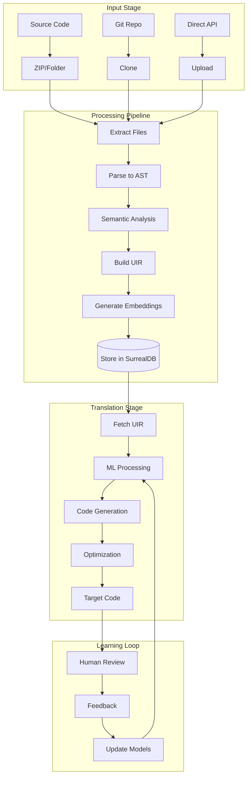

## Detailed Processing Pipeline

### 1. Input Processing

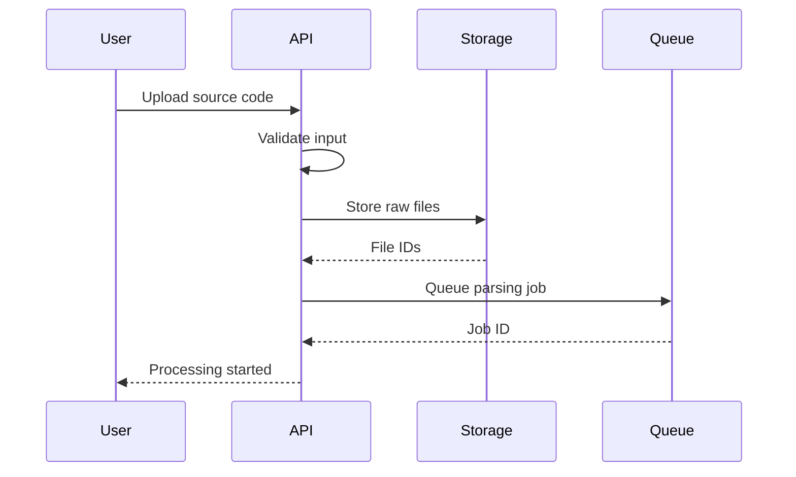

### 2. Parsing Pipeline

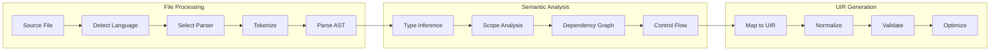

### 3. ML Pipeline Data Flow

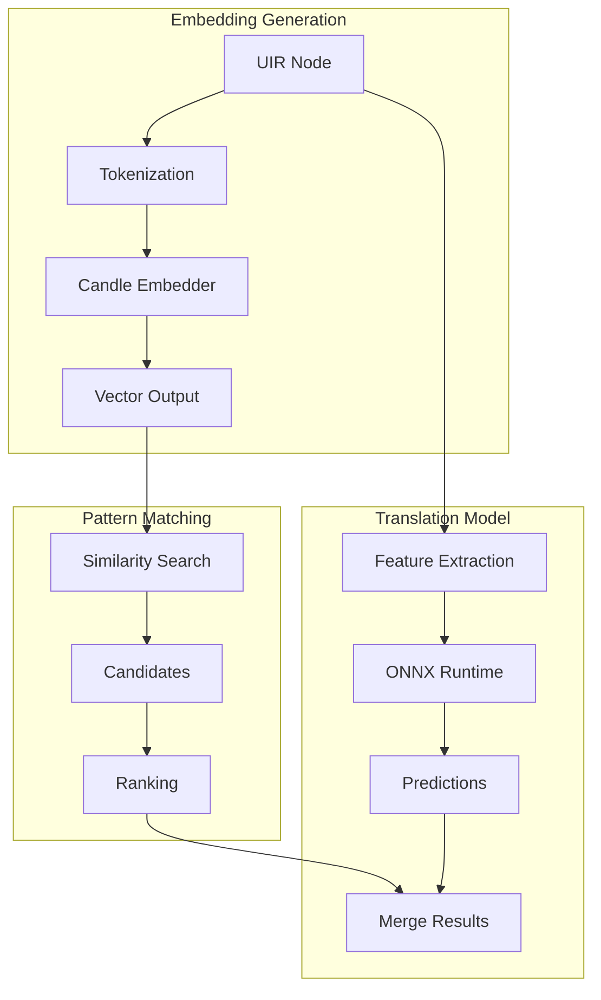

## Data Structures

### UIR Node Structure

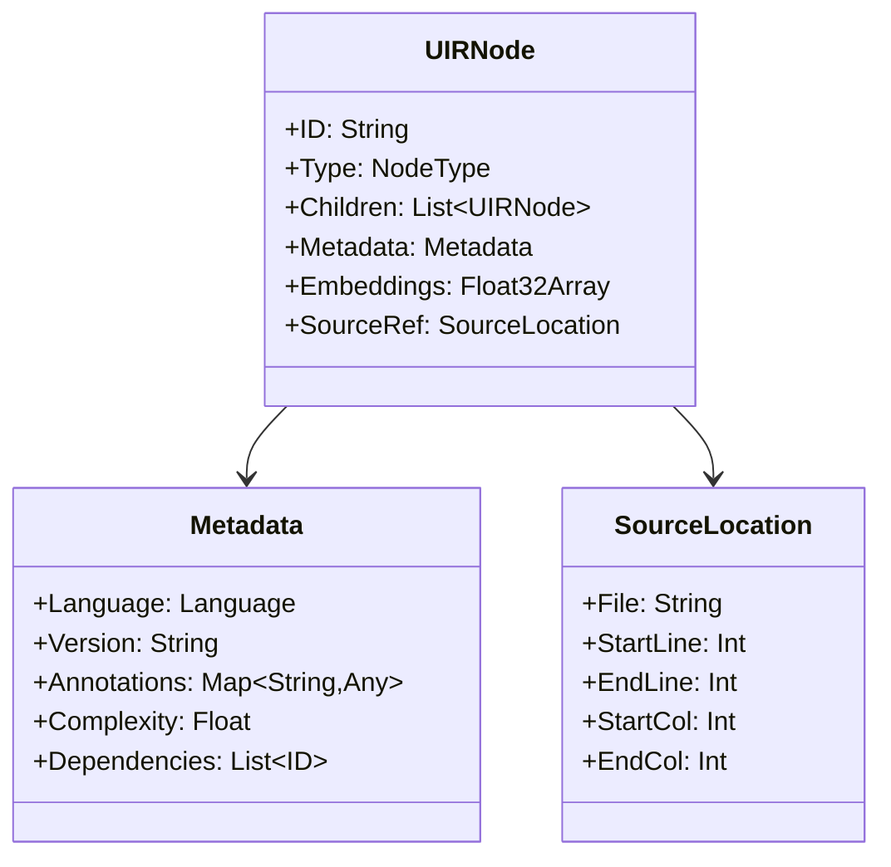

### Database Schema

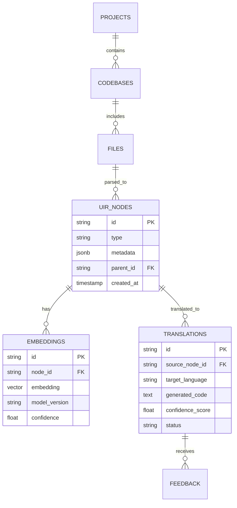

## Stream Processing

### Real-time Translation Flow

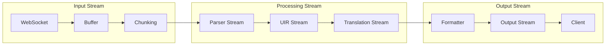

### Batch Processing

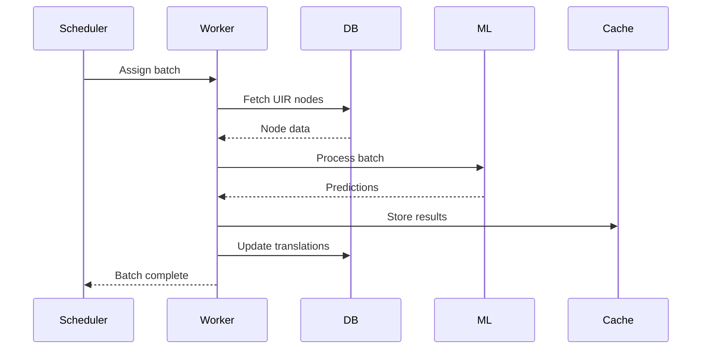

## Caching Strategy

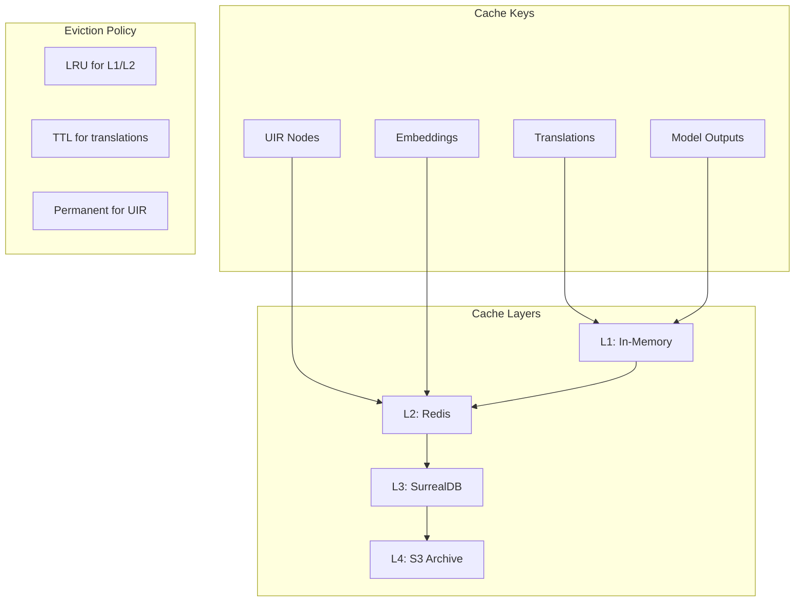

## Error Handling Flow

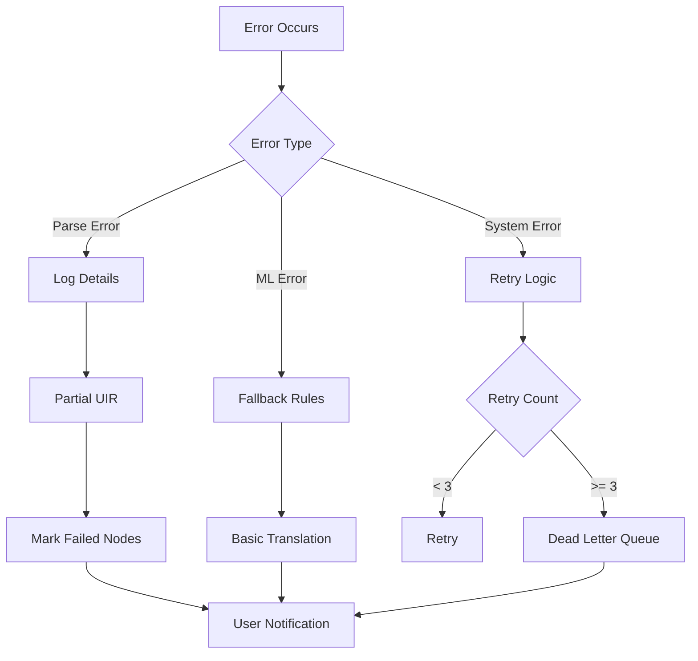

## Performance Optimization

### Parallel Processing

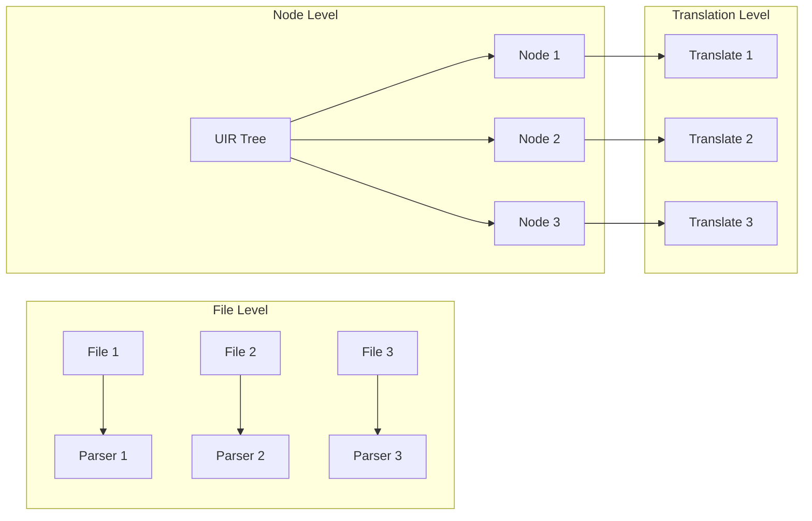

### Data Compression

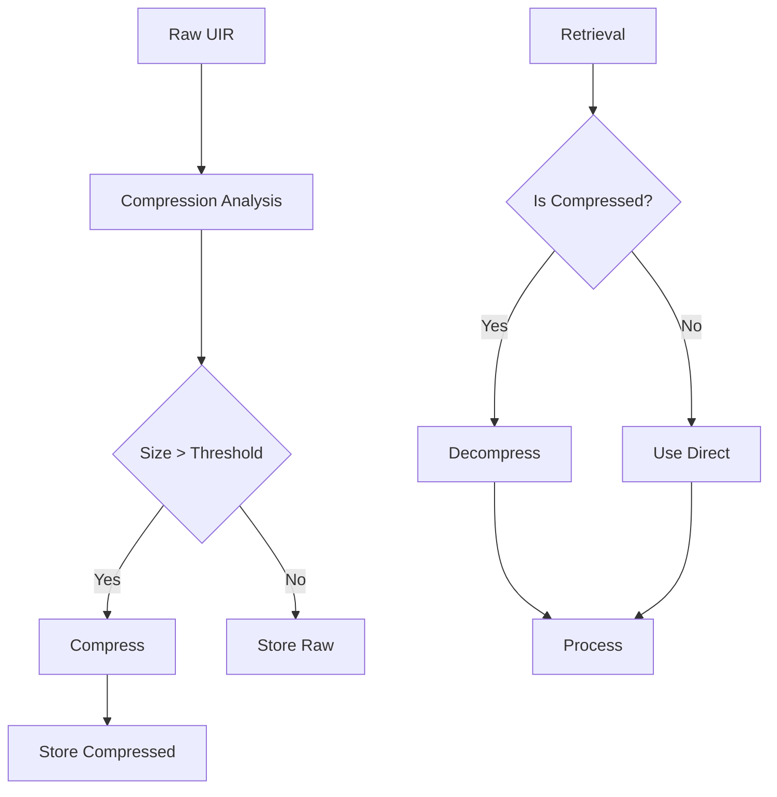

## Monitoring Points

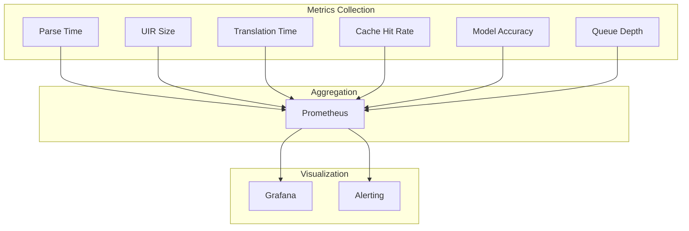

## Security Considerations

### Data Isolation

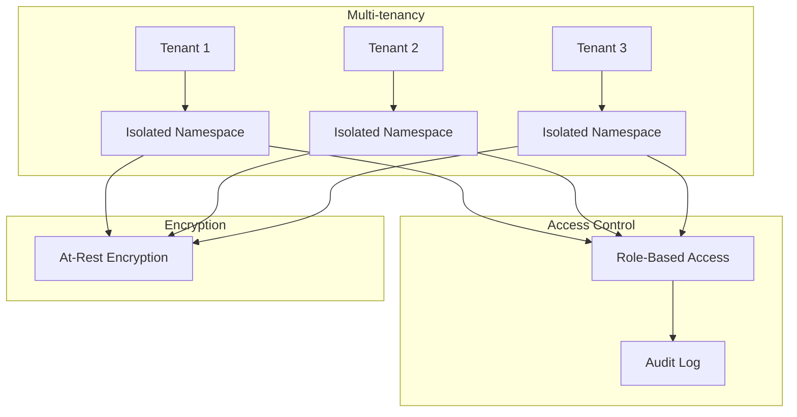

This data flow architecture ensures efficient, secure, and scalable processing of code translations while maintaining the ability to learn and improve from user feedback.
