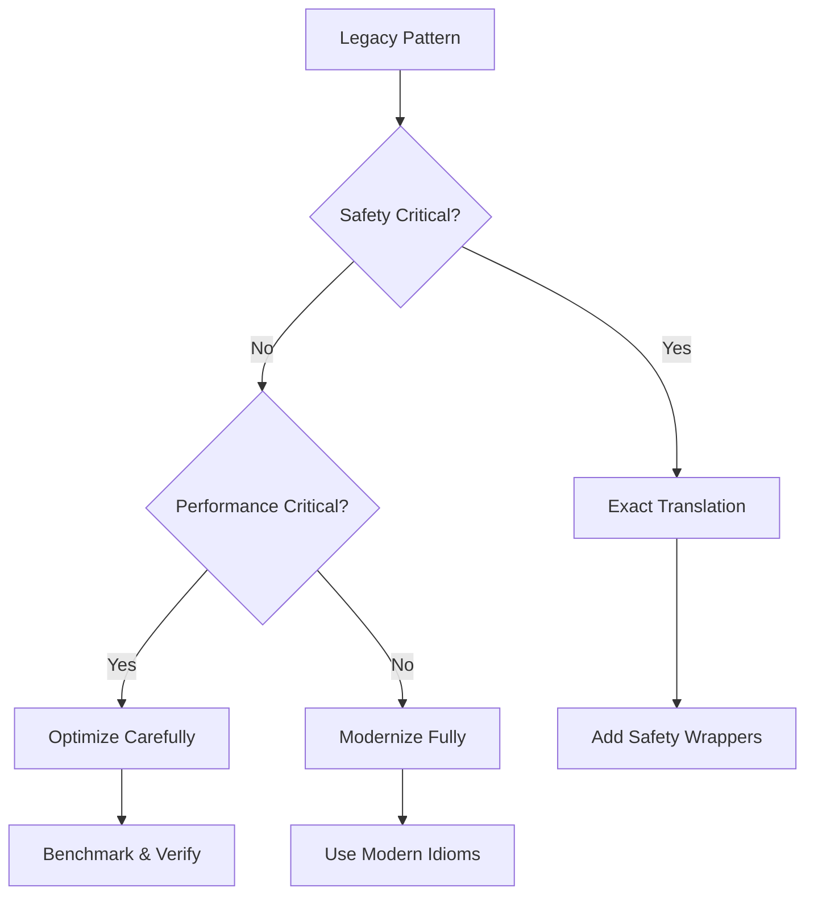

# Legacy Code Pattern Recognition and Translation

## Overview

This document catalogs common legacy patterns found in systems like SoftEtherVPN and other long-lived codebases, showing how Coalesce preserves their intent while enabling modernization.

## Common Legacy Patterns

### 1. Manual Memory Management

**Legacy Pattern (C)**
```c
// Common in network code like SoftEtherVPN
typedef struct {
    char* buffer;
    size_t size;
    size_t capacity;
} Buffer;

Buffer* CreateBuffer(size_t initial_size) {
    Buffer* buf = (Buffer*)malloc(sizeof(Buffer));
    if (!buf) return NULL;
    
    buf->buffer = (char*)malloc(initial_size);
    if (!buf->buffer) {
        free(buf);
        return NULL;
    }
    
    buf->size = 0;
    buf->capacity = initial_size;
    return buf;
}

void FreeBuffer(Buffer* buf) {
    if (buf) {
        if (buf->buffer) free(buf->buffer);
        free(buf);
    }
}
```

**UIR Representation**
```yaml
pattern:
  type: "manual_memory_management"
  operations:
    - allocate:
        struct: "Buffer"
        fields:
          - name: "buffer"
            type: "dynamic_array"
            element_type: "byte"
          - name: "size"
            type: "size_t"
          - name: "capacity"
            type: "size_t"
    - deallocate:
        cascade: true
        order: ["buffer", "self"]
  
  modernization:
    rust: "Vec<u8> with automatic memory management"
    cpp: "std::vector<uint8_t> or std::unique_ptr"
    go: "[]byte with garbage collection"
```

### 2. Platform-Specific Network Code

**Legacy Pattern (30-year-old network code)**
```c
// Windows/POSIX compatibility layer
#ifdef _WIN32
    SOCKET sock = socket(AF_INET, SOCK_STREAM, 0);
    if (sock == INVALID_SOCKET) {
        error = WSAGetLastError();
    }
#else
    int sock = socket(AF_INET, SOCK_STREAM, 0);
    if (sock < 0) {
        error = errno;
    }
#endif

// Complex state machine for protocol handling
switch (state) {
    case STATE_INIT:
        if (recv_handshake()) state = STATE_AUTH;
        break;
    case STATE_AUTH:
        if (authenticate()) state = STATE_READY;
        else state = STATE_ERROR;
        break;
    // ... 20 more states
}
```

**UIR Representation**
```yaml
pattern:
  type: "platform_abstraction"
  variants:
    - platform: "windows"
      implementation:
        socket_type: "SOCKET"
        error_check: "INVALID_SOCKET"
        error_fetch: "WSAGetLastError()"
    - platform: "posix"
      implementation:
        socket_type: "int"
        error_check: "< 0"
        error_fetch: "errno"
  
  abstraction:
    concept: "tcp_socket_creation"
    modern_equivalent:
      rust: "std::net::TcpStream"
      go: "net.Dial"
      python: "socket.socket"

state_machine:
  type: "protocol_handler"
  states:
    - name: "INIT"
      transitions:
        - condition: "recv_handshake()"
          target: "AUTH"
    - name: "AUTH"
      transitions:
        - condition: "authenticate()"
          target: "READY"
        - condition: "!authenticate()"
          target: "ERROR"
  
  modernization:
    pattern: "async_state_machine"
    benefits:
      - "Type-safe state transitions"
      - "Compile-time verification"
      - "Better error handling"
```

### 3. Global State and Threading

**Legacy Pattern**
```c
// Global state common in old systems
static int g_connection_count = 0;
static pthread_mutex_t g_mutex = PTHREAD_MUTEX_INITIALIZER;
static Connection* g_connections[MAX_CONNECTIONS];

void AddConnection(Connection* conn) {
    pthread_mutex_lock(&g_mutex);
    if (g_connection_count < MAX_CONNECTIONS) {
        g_connections[g_connection_count++] = conn;
    }
    pthread_mutex_unlock(&g_mutex);
}
```

**UIR Representation**
```yaml
pattern:
  type: "global_state_with_mutex"
  state:
    - name: "connection_count"
      type: "integer"
      scope: "global"
      initial: 0
    - name: "connections"
      type: "array"
      element_type: "Connection*"
      size: "MAX_CONNECTIONS"
      scope: "global"
  
  synchronization:
    type: "mutex"
    operations:
      - lock_before: ["read", "write"]
      - unlock_after: ["read", "write"]
  
  modernization:
    rust: |
      // Arc<Mutex<>> pattern
      struct ConnectionManager {
          connections: Arc<Mutex<Vec<Connection>>>,
      }
    go: |
      // Channel-based approach
      type ConnectionManager struct {
          connections chan Connection
      }
```

### 4. Complex Macro Systems

**Legacy Pattern**
```c
// Macro-heavy code common in old C projects
#define DECLARE_LIST(type) \
    typedef struct type##_list { \
        type* items; \
        int count; \
        int capacity; \
    } type##_list; \
    \
    type##_list* type##_list_create(); \
    void type##_list_add(type##_list* list, type item); \
    void type##_list_free(type##_list* list);

DECLARE_LIST(Connection)
DECLARE_LIST(Buffer)
```

**UIR Representation**
```yaml
pattern:
  type: "generic_via_macros"
  template:
    name: "List"
    type_parameter: "T"
    generates:
      - struct:
          name: "${T}_list"
          fields:
            - name: "items"
              type: "pointer"
              element_type: "${T}"
            - name: "count"
              type: "int"
            - name: "capacity"
              type: "int"
      - functions:
          - name: "${T}_list_create"
            returns: "${T}_list*"
          - name: "${T}_list_add"
            params: ["${T}_list*", "${T}"]
          - name: "${T}_list_free"
            params: ["${T}_list*"]
  
  instantiations:
    - type: "Connection"
    - type: "Buffer"
  
  modernization:
    concept: "generic_container"
    implementations:
      rust: "Vec<T>"
      cpp: "std::vector<T>"
      go: "[]T with generics"
```

### 5. Error Handling Evolution

**Legacy Pattern**
```c
// Error codes and goto-based cleanup
int ProcessData(const char* input, char** output) {
    int ret = ERROR_GENERAL;
    Buffer* buf = NULL;
    Parser* parser = NULL;
    
    buf = CreateBuffer(1024);
    if (!buf) {
        ret = ERROR_NO_MEMORY;
        goto cleanup;
    }
    
    parser = CreateParser(input);
    if (!parser) {
        ret = ERROR_INVALID_INPUT;
        goto cleanup;
    }
    
    if (!ParseIntoBuffer(parser, buf)) {
        ret = ERROR_PARSE_FAILED;
        goto cleanup;
    }
    
    *output = strdup(buf->buffer);
    ret = SUCCESS;
    
cleanup:
    if (parser) FreeParser(parser);
    if (buf) FreeBuffer(buf);
    return ret;
}
```

**UIR Representation**
```yaml
pattern:
  type: "goto_cleanup"
  error_model:
    type: "error_codes"
    values:
      - ERROR_GENERAL
      - ERROR_NO_MEMORY
      - ERROR_INVALID_INPUT
      - ERROR_PARSE_FAILED
      - SUCCESS
  
  control_flow:
    - allocate: "buf"
      on_failure:
        set_error: "ERROR_NO_MEMORY"
        goto: "cleanup"
    - allocate: "parser"
      on_failure:
        set_error: "ERROR_INVALID_INPUT"
        goto: "cleanup"
    - call: "ParseIntoBuffer"
      on_failure:
        set_error: "ERROR_PARSE_FAILED"
        goto: "cleanup"
    - success:
        set_error: "SUCCESS"
  
  cleanup:
    order: ["parser", "buf"]
    condition: "if_allocated"
  
  modernization:
    rust: "Result<T, E> with ? operator"
    go: "defer and error returns"
    cpp: "RAII and exceptions"
```

## Translation Strategies

### 1. Preserving Behavior



### 2. Incremental Modernization

```yaml
modernization_stages:
  - stage: 1
    name: "Direct Translation"
    goal: "Preserve exact behavior"
    changes: "Minimal syntax adaptation"
    
  - stage: 2
    name: "Safety Improvements"
    goal: "Add memory safety"
    changes: "Replace manual memory management"
    
  - stage: 3
    name: "API Modernization"
    goal: "Improve developer experience"
    changes: "Modern error handling, generics"
    
  - stage: 4
    name: "Architecture Refactor"
    goal: "Improve maintainability"
    changes: "Module boundaries, dependency injection"
```

## Real-World Examples

### SoftEtherVPN-Style Network Handler

**Original (Simplified)**
```c
typedef struct SESSION {
    SOCKET socket;
    SSL* ssl;
    THREAD* recv_thread;
    THREAD* send_thread;
    QUEUE* send_queue;
    bool halt_flag;
    LOCK* lock;
} SESSION;

void SessionMain(SESSION* s) {
    while (!s->halt_flag) {
        UCHAR buffer[4096];
        UINT size = RecvData(s, buffer, sizeof(buffer));
        if (size == 0) break;
        ProcessPacket(s, buffer, size);
    }
}
```

**Modern Translation (Rust)**
```rust
pub struct Session {
    socket: TcpStream,
    tls: TlsStream<TcpStream>,
    send_queue: Arc<Mutex<VecDeque<Vec<u8>>>>,
    shutdown: Arc<AtomicBool>,
}

impl Session {
    pub async fn run(&mut self) -> Result<()> {
        let mut buffer = vec![0u8; 4096];
        
        while !self.shutdown.load(Ordering::Relaxed) {
            match self.tls.read(&mut buffer).await {
                Ok(0) => break,
                Ok(size) => self.process_packet(&buffer[..size]).await?,
                Err(e) if e.kind() == ErrorKind::WouldBlock => continue,
                Err(e) => return Err(e.into()),
            }
        }
        
        Ok(())
    }
}
```

## Best Practices

1. **Document Intent**: Always capture WHY the code does something
2. **Preserve Quirks**: That weird behavior might be a critical workaround
3. **Test Thoroughly**: Legacy code often has undocumented requirements
4. **Gradual Migration**: Don't try to modernize everything at once
5. **Learn from History**: 30-year-old code survived for a reason

This approach ensures that even complex, battle-tested systems like SoftEtherVPN can be modernized without losing their hard-won reliability and performance characteristics.
