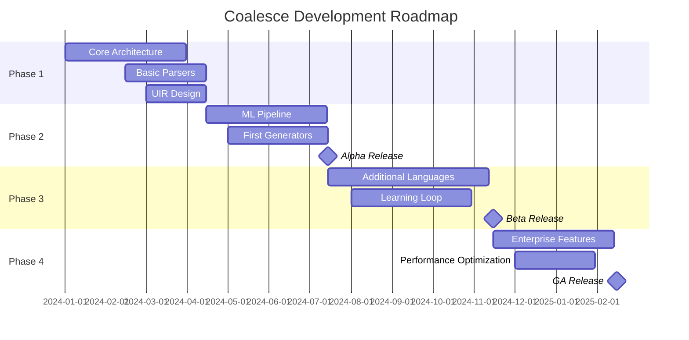
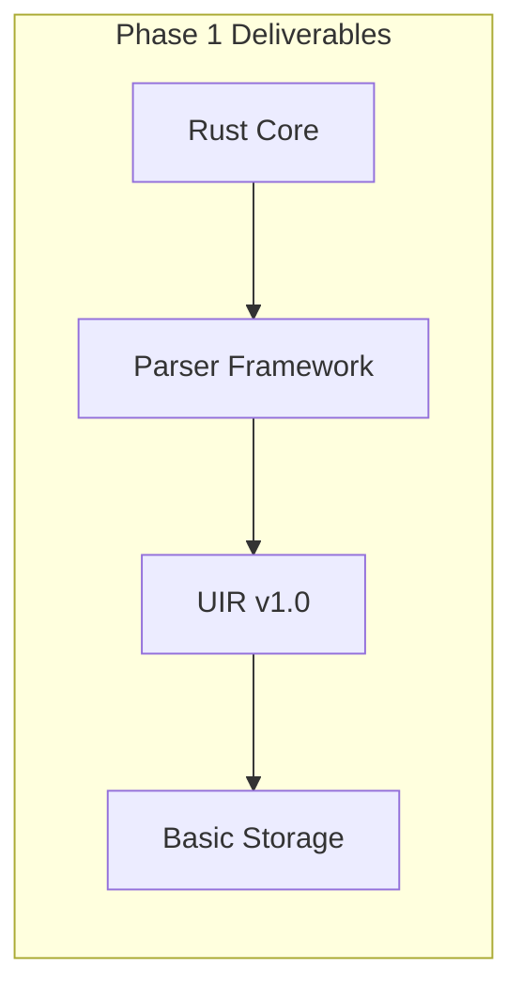
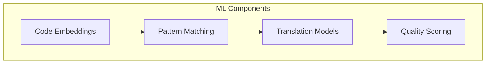
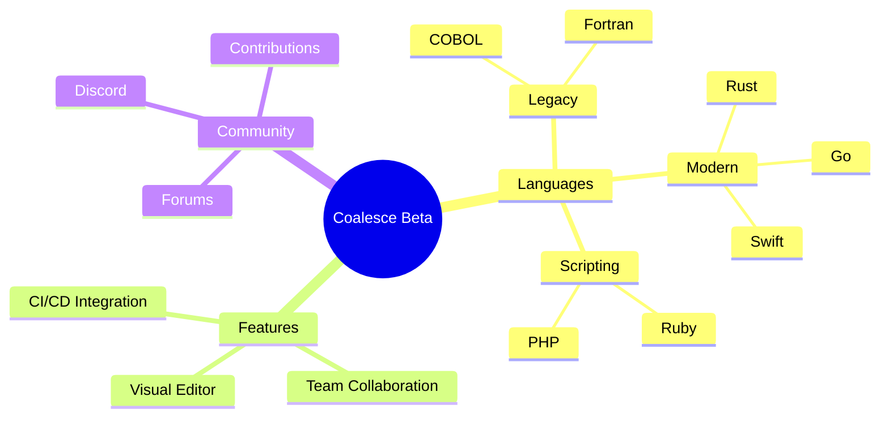
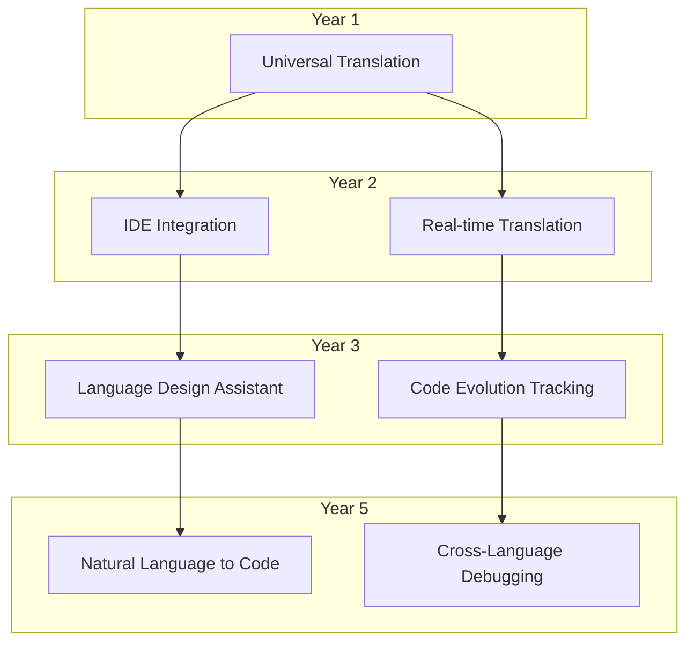

# Coalesce Roadmap

## Vision Timeline

## Phase 1: Foundation (Q1 2024)

### Milestone 1.1: Core Architecture
- [x] Project setup with Rust workspace
- [ ] SurrealDB schema design
- [ ] Basic GraphQL API structure
- [ ] SolidJS project scaffold

### Milestone 1.2: Parser Framework
- [ ] Parser trait definition
- [ ] JavaScript/TypeScript parser
- [ ] Python parser
- [ ] Testing framework

### Milestone 1.3: UIR Specification
- [ ] UIR data structures
- [ ] Serialization/deserialization
- [ ] Validation rules
- [ ] Documentation

## Phase 2: Intelligence (Q2 2024)

### Milestone 2.1: ML Pipeline
- [ ] Candle integration
- [ ] Code embedding generation
- [ ] Pattern recognition models
- [ ] ONNX export pipeline

### Milestone 2.2: Code Generation
- [ ] Generator framework
- [ ] JavaScript generator
- [ ] Python generator
- [ ] Test generation

### Milestone 2.3: Alpha Release
- [ ] CLI tool
- [ ] Basic web UI
- [ ] Documentation site
- [ ] Community feedback loop

## Phase 3: Expansion (Q3-Q4 2024)

### Milestone 3.1: Language Support
Priority languages:
1. **Legacy**: COBOL, Fortran, Pascal
2. **Enterprise**: Java, C#, Go
3. **Modern**: Rust, Swift, Kotlin
4. **Scripting**: Ruby, PHP, Perl

### Milestone 3.2: Learning System
- [ ] Feedback collection UI
- [ ] SurrealML integration
- [ ] Incremental learning
- [ ] A/B testing framework

### Milestone 3.3: Beta Release
- [ ] Public beta program
- [ ] Plugin system
- [ ] Community contributions
- [ ] Enterprise pilot program

## Phase 4: Production (Q1 2025)

### Milestone 4.1: Enterprise Features
- [ ] SSO/SAML integration
- [ ] Audit logging
- [ ] Role-based access control
- [ ] Private deployment options

### Milestone 4.2: Performance
- [ ] Distributed processing
- [ ] Caching optimization
- [ ] Incremental parsing
- [ ] Real-time collaboration

### Milestone 4.3: GA Release
- [ ] Production stability
- [ ] SLA guarantees
- [ ] Professional support
- [ ] Certification program

## Long-term Vision (2025+)

## Success Metrics

### Technical Metrics
- Translation accuracy: >95% for common patterns
- Performance: <5s for average module translation
- Language coverage: 20+ languages by GA

### Business Metrics
- Active users: 10K developers by end of Year 1
- Enterprise customers: 50+ by end of Year 2
- Code translated: 1B+ lines by Year 3

### Community Metrics
- Contributors: 100+ active contributors
- Plugins: 50+ community plugins
- Training data: 1M+ reviewed translations

## Risk Mitigation

| Risk | Impact | Mitigation |
|------|--------|------------|
| ML accuracy | High | Human-in-the-loop validation |
| Performance at scale | Medium | Distributed architecture |
| Language complexity | High | Incremental feature support |
| Adoption resistance | Medium | Strong migration tools |

## Get Involved

Want to influence the roadmap?
- Vote on feature priorities
- Contribute language parsers
- Share your use cases
- Join our advisory board
