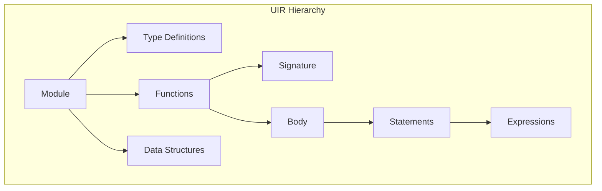
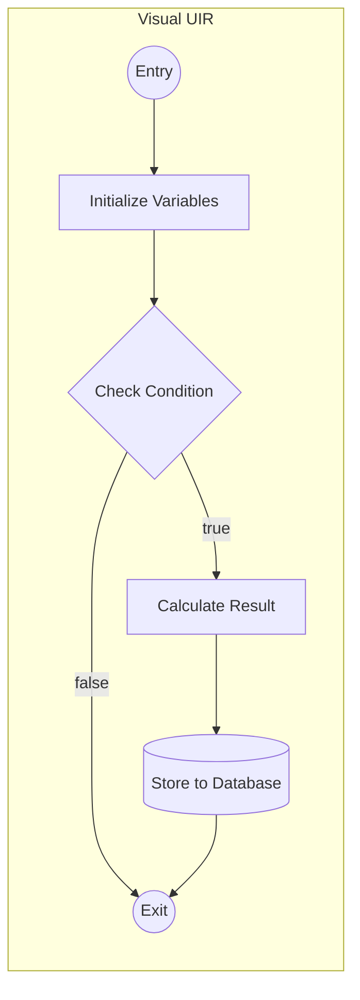
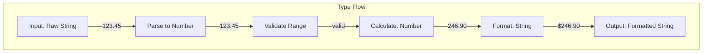

# Universal Intermediate Representation (UIR) Specification

## Overview

The Universal Intermediate Representation (UIR) is Coalesce's language-agnostic format for representing code logic. It captures intent, not syntax, making it readable, analyzable, and transformable.

## Design Principles

1. **Human-Readable**: UIR should be understandable without documentation
2. **Semantically Complete**: Capture all behavioral aspects of the original code
3. **Language-Agnostic**: No bias toward any particular programming paradigm
4. **Extensible**: Easy to add new concepts without breaking existing ones
5. **Analyzable**: Support for static analysis and optimization

## UIR Structure



## Core Components

### 1. Module Definition

```yaml
# UIR Module Example
module:
  id: "uuid-12345"
  name: "InterestCalculator"
  version: "1.0.0"
  source:
    language: "COBOL"
    file: "INTEREST.COB"
    lines: [1, 45]
  imports:
    - module: "StandardMath"
      symbols: ["multiply", "divide"]
  exports:
    - symbol: "calculateInterest"
      type: "function"
```

### 2. Type System

UIR uses a rich type system that captures both structure and intent:

```yaml
types:
  # Numeric type with precision info (from COBOL PIC)
  - id: "Principal"
    kind: "numeric"
    properties:
      precision: 9
      scale: 2
      signed: false
      original: "PIC 9(7)V99"
    constraints:
      min: 0
      max: 9999999.99
  
  # Composite type
  - id: "InterestCalculation"
    kind: "record"
    fields:
      - name: "principal"
        type: "Principal"
        required: true
      - name: "rate"
        type: "Percentage"
        required: true
      - name: "time"
        type: "Duration"
        required: true
```

### 3. Function Representation

```yaml
functions:
  - id: "calculateInterest"
    name: "calculateInterest"
    visibility: "public"
    signature:
      inputs:
        - name: "principal"
          type: "Principal"
          mode: "in"
        - name: "rate"
          type: "Percentage"
          mode: "in"
        - name: "time"
          type: "Duration"
          mode: "in"
      outputs:
        - name: "interest"
          type: "Principal"
    metadata:
      pure: true
      side_effects: []
      complexity: 2
    body:
      kind: "block"
      statements:
        - kind: "return"
          expression:
            kind: "arithmetic"
            operator: "divide"
            operands:
              - kind: "arithmetic"
                operator: "multiply"
                operands:
                  - kind: "arithmetic"
                    operator: "multiply"
                    operands:
                      - kind: "variable"
                        name: "principal"
                      - kind: "variable"
                        name: "rate"
                  - kind: "variable"
                    name: "time"
              - kind: "literal"
                value: 100
                type: "Integer"
```

### 4. Control Flow

```yaml
# Complex control flow example
control_flow:
  - kind: "conditional"
    condition:
      kind: "comparison"
      operator: "greater_than"
      left:
        kind: "variable"
        name: "balance"
      right:
        kind: "literal"
        value: 0
    then_branch:
      kind: "block"
      statements:
        - kind: "assignment"
          target: "status"
          value:
            kind: "literal"
            value: "ACTIVE"
    else_branch:
      kind: "block"
      statements:
        - kind: "assignment"
          target: "status"
          value:
            kind: "literal"
            value: "INACTIVE"

  # Loop representation
  - kind: "loop"
    loop_type: "while"
    condition:
      kind: "comparison"
      operator: "less_than"
      left:
        kind: "variable"
        name: "counter"
      right:
        kind: "variable"
        name: "limit"
    body:
      kind: "block"
      statements:
        - kind: "call"
          function: "processRecord"
          arguments:
            - kind: "array_access"
              array: "records"
              index:
                kind: "variable"
                name: "counter"
```

### 5. Legacy Pattern Preservation

UIR preserves legacy patterns that don't map cleanly to modern concepts:

```yaml
# COBOL-style level numbers
legacy_patterns:
  - kind: "hierarchical_data"
    pattern: "COBOL_LEVEL_NUMBERS"
    structure:
      - level: 1
        name: "CUSTOMER-RECORD"
        children:
          - level: 5
            name: "CUST-NAME"
            children:
              - level: 10
                name: "FIRST-NAME"
                type: "String[20]"
              - level: 10
                name: "LAST-NAME"
                type: "String[30]"

# GOTO preservation (with modernization hints)
  - kind: "unconditional_jump"
    pattern: "GOTO"
    target: "ERROR-HANDLER"
    modernization_hint:
      pattern: "exception_handling"
      suggestion: "try-catch block"
```

### 6. Platform-Specific Features

```yaml
# Network programming example (like SoftEtherVPN)
platform_specific:
  - kind: "system_call"
    platform: "POSIX"
    call: "socket"
    parameters:
      - name: "domain"
        value: "AF_INET"
      - name: "type"
        value: "SOCK_STREAM"
      - name: "protocol"
        value: 0
    abstraction:
      concept: "tcp_socket_creation"
      portable: true

  - kind: "memory_operation"
    operation: "direct_pointer_manipulation"
    safety: "unsafe"
    abstraction:
      concept: "buffer_management"
      safer_alternative: "managed_buffer"
```

## Visual Representation

### UIR Graph Notation



### Type Flow Visualization



## Semantic Annotations

UIR includes rich semantic information:

```yaml
semantics:
  - function: "calculateTax"
    annotations:
      - kind: "business_rule"
        rule: "TAX_CALCULATION_2023"
        description: "Implements 2023 tax calculation rules"
        compliance: ["IRS_SECTION_501", "STATE_TAX_CODE_37"]
      
      - kind: "performance"
        complexity: "O(n)"
        typical_size: "n < 1000"
        
      - kind: "security"
        validates_input: true
        sanitizes_output: true
        audit_required: true
```

## Example: Complex Legacy Translation

### Original COBOL
```cobol
PROCEDURE DIVISION.
    PERFORM VARYING WS-I FROM 1 BY 1 
        UNTIL WS-I > 10
        IF CUSTOMER-TYPE(WS-I) = 'PREMIUM'
            COMPUTE DISCOUNT(WS-I) = 
                ORDER-TOTAL(WS-I) * 0.15
        ELSE
            IF ORDER-TOTAL(WS-I) > 1000
                COMPUTE DISCOUNT(WS-I) = 
                    ORDER-TOTAL(WS-I) * 0.10
            ELSE
                MOVE ZERO TO DISCOUNT(WS-I)
            END-IF
        END-IF
    END-PERFORM.
```

### UIR Representation
```yaml
- kind: "loop"
  loop_type: "for"
  iterator:
    name: "i"
    start: 1
    end: 10
    step: 1
  body:
    kind: "conditional"
    branches:
      - condition:
          kind: "comparison"
          operator: "equals"
          left:
            kind: "array_access"
            array: "customerType"
            index: { kind: "variable", name: "i" }
          right:
            kind: "literal"
            value: "PREMIUM"
        action:
          kind: "assignment"
          target:
            kind: "array_access"
            array: "discount"
            index: { kind: "variable", name: "i" }
          value:
            kind: "arithmetic"
            operator: "multiply"
            operands:
              - kind: "array_access"
                array: "orderTotal"
                index: { kind: "variable", name: "i" }
              - kind: "literal"
                value: 0.15
      - condition:
          kind: "comparison"
          operator: "greater_than"
          left:
            kind: "array_access"
            array: "orderTotal"
            index: { kind: "variable", name: "i" }
          right:
            kind: "literal"
            value: 1000
        action:
          kind: "assignment"
          target:
            kind: "array_access"
            array: "discount"
            index: { kind: "variable", name: "i" }
          value:
            kind: "arithmetic"
            operator: "multiply"
            operands:
              - kind: "array_access"
                array: "orderTotal"
                index: { kind: "variable", name: "i" }
              - kind: "literal"
                value: 0.10
      - default:
          kind: "assignment"
          target:
            kind: "array_access"
            array: "discount"
            index: { kind: "variable", name: "i" }
          value:
            kind: "literal"
            value: 0
```

## Benefits of This UIR Design

1. **Readable**: Even complex logic is clear
2. **Preserves Intent**: Business rules are explicit
3. **Language-Neutral**: No syntax preferences
4. **Analyzable**: Can detect patterns, optimize, and verify
5. **Extensible**: New concepts don't break existing ones
6. **Traceable**: Every UIR element maps back to source

This UIR design ensures that even 30-year-old legacy code like SoftEtherVPN can be accurately represented, understood, and transformed while preserving all its intricate behavior and accumulated wisdom.
